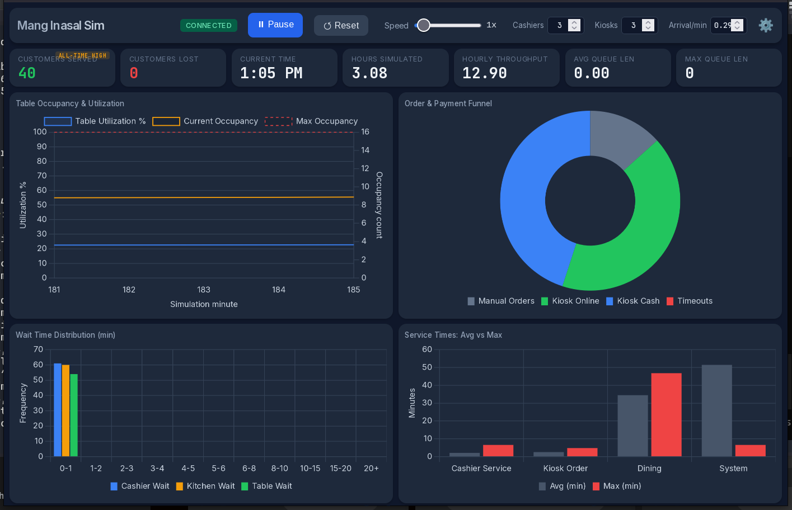

# mang-inasal-des-sim

Discrete-event simulation of a Mang Inasal restaurant branch, built with Python and SimPy.

Models the complete customer journey from arrival to departure across cashier, kitchen, and dining stages under both regular and peak-hour conditions. Supports an experimental kiosk-first workflow with online payment confirmation and cashier manual override for non-kiosk customers. All simulation parameters are externalized to `config.json` — no hardcoded values in source code.



## How It Works

Every customer entity flows through a configurable pipeline of FIFO stages. Two pipelines are available:

**Standard mode (kiosk disabled):**
```
Arrival → Cashier Queue → Kitchen Prep → Release Claim → Seating Wait → Dining → Depart
```

**Kiosk-first mode (kiosk enabled):**
```
Arrival → Kiosk → Cashier Confirm → Kitchen Prep → Release Claim → Seating Wait → Dining → Depart
```

In kiosk mode, customers place orders at self-service kiosks and either pay online (quick cashier confirmation) or at the counter. A configurable `manual_override_probability` bypasses the kiosk for non-tech-savvy customers, routing them directly to a cashier for full order entry + payment. Kiosk state and capacity can be toggled at runtime via the web interface — no restart required.

Each stage is parameterized with bounded probability distributions triangulated from interview data and direct observation:

| Stage | Resource | Capacity | Distribution |
|-------|----------|----------|-------------|
| Arrival | — | — | NHPP (λ=0.29 regular, 0.58 peak) |
| Kiosk *(optional)* | simpy.Resource | configurable via `kiosk.kiosk_count` | triangular(1, 2, 5) min |
| Cashier | simpy.Resource | 3 counters | triangular(2, 3, 7) min / kiosk confirm triangular(0.5, 1, 1.5) min |
| Kitchen | simpy.Resource | 10 stations | triangular(7, 7, 10) regular / triangular(15, 17, 20) peak + bottleneck surcharge |
| Release | simpy.Resource *(optional)* | 4 servers | uniform(0.5, 1.0) min |
| Dining | simpy.Resource | 39 tables | triangular(20, 30, 50) min |

Peak hours (11AM–1PM lunch, 6PM–8PM dinner) increase both arrival rate and kitchen prep times. "Regular Chicken" and "Sisig" orders incur extra prep time.

Customers have configurable patience limits: if wait time exceeds their sampled patience (triangular(15, 30, 60) min), they abandon the queue. Feature flags toggle patience, the server resource bottleneck, and the kiosk-first workflow independently.

## Architecture

```
config.json           — All simulation parameters (JSON, feature-flagged)
front-end/            — Web dashboard (HTML, CSS, JS)
  ├── index.html
  ├── style.css
  └── script.js
src/
├── config.py         — JSON loader & dynamic property access
├── metrics.py        — Metrics collector & reporter
├── main.py           — CLI entry point (headless simulation)
├── server.py         — WebSocket + HTTP server entry point (web dashboard)
├── base/             — Shared abstractions
│   └── resource_manager.py — Resource base class (simpy.Resource wrapper)
├── entities/         — Resource wrappers
│   ├── customer.py   — Customer state, timestamps, patience, payment fields
│   ├── cashier.py    — CashierManager (3 counters)
│   ├── kitchen.py    — KitchenManager (10 stations, dynamic prep)
│   ├── server.py     — ServerManager (4 servers, optional release bottleneck)
│   ├── dining.py     — DiningManager (39 tables)
│   └── kiosk.py      — KioskManager (kiosk.kiosk_count, experimental)
└── engine/           — SimPy process generators
    ├── registry.py   — StageFunc type + BUILTIN / EXPERIMENTAL stage dicts
    ├── stages.py     — Individual step functions (cashier, kiosk, confirm, kitchen, release, dining)
    ├── lifecycle.py  — Dynamic stage-loop pipeline
    ├── arrivals.py   — NHPP arrival generator with manual-override branching
    └── monitor.py    — Periodic KPI snapshots
```

## Prerequisites

- Python 3.10+
- [SimPy](https://simpy.readthedocs.io/) 4.x
- [websockets](https://websockets.readthedocs.io/) 13.0+ *(web dashboard only)*

## Setup

```powershell
python -m venv .venv
.venv\Scripts\activate
pip install -r requirements.txt
```

## Run

### CLI (headless, no dashboard)

```powershell
python -m src.main
```

### Web Dashboard

```powershell
python -m src.server
```

Then open **http://0.0.0.0:8000** in your browser.

The web interface provides a real-time dashboard with queue/occupancy charts, configurable simulation speed, and a settings panel to toggle resources (kiosk, cashiers, etc.) and configure the system start time at runtime without restarting.

## Screenshot

<!-- TODO: Replace with actual dashboard screenshot -->


## Configuration

Edit `config.json` at the project root. All parameters — arrival rates, resource counts, distribution bounds, peak windows, feature toggles, kiosk/payment settings — live in a single JSON document. The `Config` class in `src/config.py` loads this file at runtime.

### Feature Flags

| Flag | Effect |
|---|---|
| `customer_patience_and_abandonment` | Customers abandon the queue if wait exceeds sampled patience |
| `server_resource_bottleneck` | Release stage requires a server resource (capacity = server_count) |
| `kiosk_experimental_mode` | Enables kiosk-first workflow (kiosk → cashier confirm) |

Toggle any flag between `true` / `false` and re-run — zero code changes required.

### Additional Configurable Parameters

| Parameter | Path in `config.json` | Description |
|---|---|---|
| Order item count | `menu.min_items` / `menu.max_items` | Number of items per customer order (randint range) |
| Monitoring interval | `monitoring_interval_minutes` | Frequency of queue/occupancy snapshots (minutes) |
| Online payment probability | `kiosk.payment.online_payment_probability` | Likelihood a kiosk customer pays via app vs. cash |

Kiosk state and capacity can be toggled at runtime via the settings panel in the web dashboard — no restart required.
